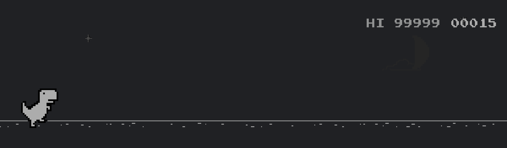

<a href="https://github.com/stevejkang/junctionx-asia-2020-nodejs">
  
</a>

# Chrome-Dino-Max-score
> Run this script to change your high score to max value in the [Chrome Dino](chrome://dino) game!



## 🚀 How it works

```js
window.errorPageController.updateEasterEggHighScore(67999979)
```

When you pass the value `67999979` to `updateEasterEggHighScore`, the game will update the high score to `99999`.

The rest is just a Python script that opens Chrome as remote debugging mode, moves to the dino game, executes the script, and refreshes the page.
